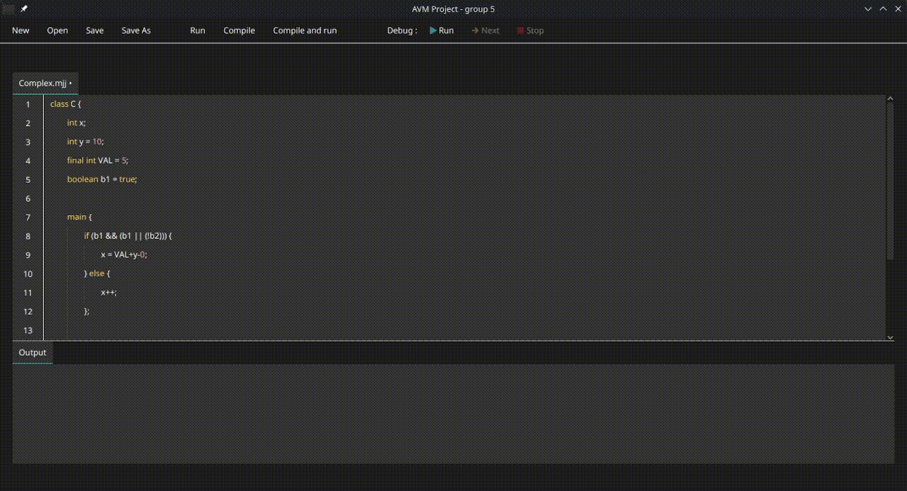

# MiniJaja Compiler Studio

A complete compiler, interpreter, and IDE for the MiniJaja programming language. Built as a group project during the first semester of M1 Computer Science at Université de Franche-Comté.

<!---

-->

## Overview

MiniJaja Studio is an educational compiler and interpreter system for MiniJaja, a simplified Java-like programming language designed for teaching compiler construction and program execution concepts. The project includes a full-featured JavaFX-based IDE with real-time compilation, step-through debugging (step-by-step and breakpoints), and memory visualization.

## Features

### Language Support

**MiniJaja** - A class-based source language supporting:
- Variables and constants with type checking (`int`, `boolean`, `void`)
- Single-dimensional arrays
- Methods with parameters and return values
- Control flow structures (`if/else`, `while`)
- Arithmetic and logical operators
- Console Output operations

**JajaCode** - Low-level bytecode representation:
- Stack machine instructions
- Memory operations (load, store, heap allocation)
- Control flow primitives (goto, conditional jumps)
- Array manipulation

### IDE Capabilities

- **Dual Editor**: Edit both MiniJaja source code and JajaCode bytecode
- **Compilation**: Transform MiniJaja programs into JajaCode with comprehensive error reporting
- **Interpretation**: Execute both language levels directly
- **Debugging**: Step-by-step execution with breakpoint support
- **Memory Visualization**: Real-time stack and heap inspection during program execution
- **Syntax Highlighting**: Color-coded syntax for improved readability
- **File Management**: Load and save `.mjj` source files

## Architecture

The project follows a modular architecture with clear separation of concerns:

```
├── memory/              Memory management (stack, heap, symbol tables)
├── ast/                 ANTLR-based parser and AST construction
├── compiler/            MiniJaja to JajaCode compilation with type checking
├── interpreter/         Dual interpreters for MiniJaja and JajaCode
├── driver/              JavaFX IDE application
├── integration_tests/   Integration test suite
└── acceptation_tests/   BDD-style acceptance tests (Cucumber)
```

## Technology Stack

- **Java 22** - Core implementation language
- **Maven** - Build and dependency management
- **ANTLR 4** - Lexer and parser generation
- **JavaFX** - GUI framework
- **JUnit 5 + Mockito** - Unit testing
- **Cucumber/Gherkin** - Acceptance testing
- **JaCoCo** - Code coverage analysis

## Getting Started

### Prerequisites

- Java Development Kit (JDK) 22 or higher
- Maven 3.6+

### Building the Project

```bash
# Compile all modules
mvn clean install

# Run tests
mvn test

# Generate code coverage report
mvn jacoco:report
```

### Running the IDE

```bash
# Launch the MiniJaja Studio IDE
cd driver
mvn javafx:run
```

Or use the Maven wrapper :

```bash
./mvnw -pl driver javafx:run
```

Or the produced jar :

```bash
cd driver/target
java -jar driver-VERSION.jar
```

### Example Programs

Example MiniJaja programs are included in the `acceptation_tests/src/test/resources/` directory:

- `Simple.mjj` - Basic class structure
- `BasicOperations.mjj` - Variable declarations and arithmetic
- `Loops.mjj` - While loop demonstration
- `Conditionals.mjj` - Conditional branching
- `Complex.mjj` - Methods, parameters, and I/O operations

### Generating Documentation

Generate JavaDoc for all modules:

```bash
# Linux/macOS
./generate-javadoc.sh

# Windows
generate-javadoc.bat
```

Documentation will be available in `target/site/apidocs/` for each module.

## Code Quality

The project maintains high code quality standards with continuous integration and automated testing.


- **Unit Tests**: Comprehensive test coverage across all modules
- **Integration Tests**: End-to-end compilation and execution verification
- **Acceptance Tests**: BDD scenarios validating language specifications
- **Static Analysis**: SonarQube integration for code quality metrics
- **Code Coverage**: JaCoCo reports with detailed coverage statistics

## Project Context

This project was developed as part of the "Atelier de Mise en oeuvre de la Validation" (AMV) course during the first semester of the Master's program in Computer Science at Université de Franche-Comté (2024-2025). The project was completed by a team of six students over the course of the semester.

### Team Size
6 developers

### Academic Context
- **Program**: Master 1 Computer Science
- **Course**: AMV (Application Machines Virtuelles)
- **Semester**: Fall 2025
- **Institution**: Université de Franche-Comté

## Development

### Continuous Integration

The project uses GitHub Actions for automated builds and testing (but was originally designed for the private university GitLab) :
- Automated compilation on push and pull requests
- Test execution across all modules
- Code coverage reporting

### Project Structure

Each module has its own `pom.xml` and follows Maven's standard directory layout:
- `src/main/java` - Production code
- `src/main/antlr4` - ANTLR grammar files (AST module)
- `src/main/resources` - Resource files
- `src/test/java` - Test code
- `src/test/resources` - Test resources

## License

This project was developed for educational purposes as part of university coursework.

## Acknowledgments

Special thanks to the teaching staff of the course and my teammates for their implication throughout the project !
